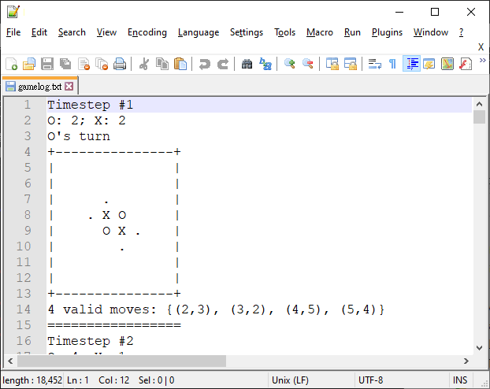

# Othello (Reversi) AI Template for I2P(2)_2020_SR

We will use Othello AI in mini-project 3.


Note that the `.` in the screenshot indicates the valid moves for the current player.

## Compile

If you have `make` installed:

```sh
make
```

Otherwise: (Assuming `g++` is installed)

```sh
g++ -Wall -Wextra --std=c++14 -o main main.cpp
g++ -Wall -Wextra --std=c++14 -o player_random player_random.cpp
g++ -Wall -Wextra --std=c++14 -o player_infinite player_infinite.cpp
g++ -Wall -Wextra --std=c++14 -o player_partial player_partial.cpp
g++ -Wall -Wextra --std=c++14 -o player_invalid player_invalid.cpp
```

Or you can compile them one by one through IDEs.

## Game Manager

The code ([main.cpp](/main.cpp)) contains the game logic of Othello. It should work in Linux, Windows, and MacOS.

You can change the constant `timeout` in the code to a larger number to increase the max calculation time for each action.

Note that this code isn't used by the TAs to grade your program, this is a simplified version for easy testing.

Syntax:

```sh
# In Linux / Mac
./main ./<player1> ./<player2>
# Windows
main <player1>.exe <player2>.exe
```

Example:

In Terminal / `cmd`:

```sh
# In Linux / Mac
./main ./player_random ./player_infinite
# In Windows
main player_random.exe player_infinite.exe
```

**Mac Only**:

Install `coreutils` with homebrew.

```sh
brew install coreutils
```

If you do not have homebrew installed, follow the [installation guide](https://docs.brew.sh/Installation).

## Players

Take the random agent ([player_random.cpp](/player_random.cpp)) for the starting template. You can simply modify the function `write_valid_spot` to change the A.I.'s behavior.

- [player_random.cpp](/player_random.cpp) is a simple A.I. that randomly picks a action from all valid actions.
- [player_infinite.cpp](/player_infinite.cpp) shows that your program can keep output better actions by flushing the file stream.
- [player_partial.cpp](/player_partial.cpp) represents the situation that if your program is terminated during output, the last successful action is picked.
- [player_invalid.cpp](/player_invalid.cpp) shows that if you output an invalid action, or do not output an action, or your program crashes, you lose immediately.

### Example Input

```
2
0 0 0 0 0 0 0 0
0 0 0 0 0 0 0 0
0 1 2 2 2 0 0 0
0 0 1 2 1 0 0 0
0 0 2 1 1 0 0 0
0 0 0 1 1 0 0 0
0 0 0 0 1 0 0 0
0 0 0 0 0 0 0 0
9
2 0
3 1
3 5
4 1
4 5
5 5
6 3
7 4
7 5

```

The first number indicates which side you are playing. (`1` for black, `2` for white)

The first 8*8 numbers represent the board state:
- `0`: empty space
- `1`: black
- `2`: white

The next number indicates N, the number of next valid moves of your player.

The next N lines contains the coordinates of the valid moves.

### Example Output

```
2 0
```

Output a coordinate where you want to put your disc at.

```
2 0
3 1
2
```

You can keep update the new coordinate until your process is killed. Make sure the coordinates are flushed to the disk through `ofstream.flush()`.

In the above sample, the last successful coordinate is `(3,1)`.

## Log File

After running the game manager, `gamelog.txt` is created.



As shown as the screenshot above, you can disable WordWrap (`View > Word wrap`) in [Notepad++](https://notepad-plus-plus.org/) and set the height of the window to show about 16 lines. Then, you can inspect the game process by pressing `PAGEUP`/`PAGEDOWN`. (By setting the page height to 16 lines, moving through pages can cause the effect of Persistence of vision. So the game process looks like a simple animation with the ability to fast-forward/rewind.)

## FAQ

Haven't receive any questions yet...
